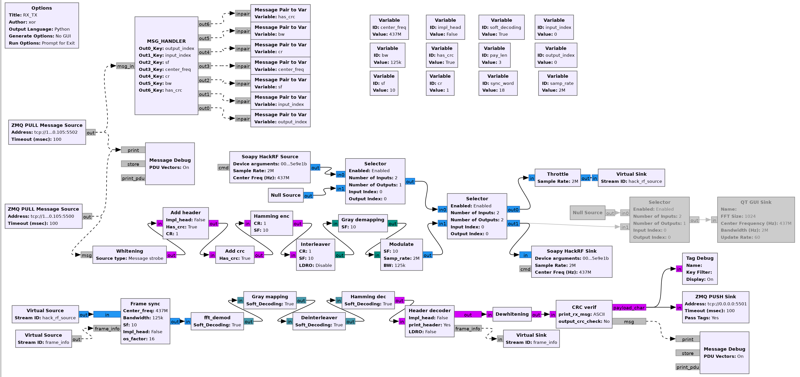
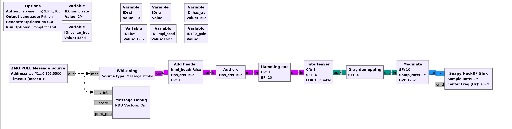

# gr-lora_sdr_docker

Docker image for [gr-lora_sdr](https://github.com/tapparelj/gr-lora_sdr) project. This image uses HackRF SDR.

HackRF LoRa transceiver with zmq control

HackRF LoRa TX test with zmq msg source

## Using
```
git clone https://github.com/CrinitusFeles/gr-lora_sdr_docker.git
```
```
cd gr-lora_sdr_docker
```
```
docker build --tag 'gnuradio_lora' .
```

For Windows you need to use WSL2 and install [usbipd V^4.0.0](https://github.com/dorssel/usbipd-win/releases).

After installation usbipd you need to forward SDR device:

Running
```
usbipd list
```
you should see something like this:
```
BUSID  VID:PID    DEVICE                                                        STATE
2-1    0458:0186  USB-устройство ввода                                          Not shared
2-5    062a:4101  USB-устройство ввода                                          Not shared
2-14   8087:0026  Intel(R) Wireless Bluetooth(R)                                Not shared
3-3    0403:6001  USB Serial Converter                                          Not shared
4-2    1d50:6089  HackRF One                                                    Not shared
```
to share the device to WSL2 you need to run

```
usbipd bind -b 4-2
```

After that STATE of choosed device should changed to **Shared**.
Shared device could be attached to WSL2:

```
usbipd attach -w -b 4-2
```
After that you can test device inside container if you build the image without last string: `CMD python RX_TX.py` and run it in interactive mode:
```
docker run -it --privileged -v /dev/bus/usb:/dev/bus/usb gnuradio_lora
```

In interactive mode call:
```
SoapySDRUtil --find
```
where if your device connected you should see:
```
######################################################
##     Soapy SDR -- the SDR abstraction library     ##
######################################################

Found device 0
  device = HackRF One
  driver = hackrf
  label = HackRF One #0 81c69dc2f5e9e1b
  part_id = a000cb3c006a4f64
  serial = 0000000000000000081c69dc2f5e9e1b
  version = local-57ed3eb
```

After checking device recognition you can put back commented string in Dockerfile and rebuild it.
Now you can use LoRa transceiver with HackRF in docker:
```
docker run --privileged -v /dev/bus/usb:/dev/bus/usb gnuradio_lora
```

or use docker compose:

``` yaml
version: '3.8'

services:
  ground_station:
    image: gnuradio_lora
    container_name: gnuradio_lora
    build:
      context: ./
      dockerfile: Dockerfile
    devices:
      - /dev/bus/usb:/dev/bus/usb
```

```
docker compose up
```

